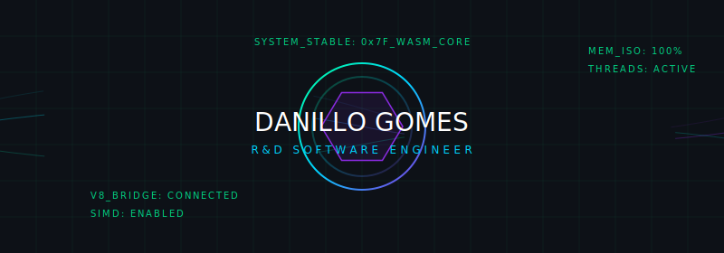
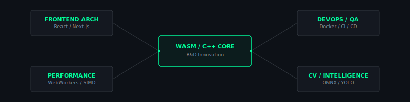
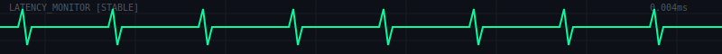

  

  
<b>Software Engineer | Research & Development (R&D)</b>

  
<i>Specializing in Frontend Architecture, WebAssembly & High-Performance Computing</i>

  

    
    
  

---

### // EXECUTIVE_SUMMARY

T-Shaped Software Engineer with **6+ years of experience**. I bridge the gap between heavy computational logic and modern browser environments. Currently collaborating with **HP Inc.** on high-impact R&D initiatives, transforming server-side bottlenecks into fluid, client-side experiences.

  <table width="100%">
    <tr>
      <td width="50%" align="center">
        
      </td>
      <td width="50%" valign="middle">
        <h4>// STRATEGIC_ROI</h4>
        <ul>
          <li><b>Cost Reduction:</b> Shifted 40% of cloud processing to the client using WASM/C++.</li>
          <li><b>Efficiency:</b> Saved 60min/sprint by optimizing CI/CD workflows.</li>
          <li><b>Quality:</b> Enforced 80% coverage threshold for R&D stability.</li>
          <li><b>Stability:</b> Resolved critical memory leaks for <2GB RAM hardware.</li>
        </ul>
      </td>
    </tr>
  </table>

---

### // SYSTEM_ARCHITECTURE_BLUEPRINT

  

---

### // CASE_STUDIES [Problem-Solution-Impact]

#### **1. RPG Code | Browser-Based CS Platform**

- **PROBLEM:** Standard JS interpreters were too slow for real-time TDD validation and blocked the UI during complex Python loops.
- **SOLUTION:** Engineered a non-blocking execution engine using **Pyodide** inside isolated **Web Workers**. Implemented a custom memory lifecycle management system in React 19.
- **IMPACT:** Zero UI jank during high-load executions and flawless memory stability during 100+ consecutive code restarts.
- **[View Project](https://danillogomes.com/code-rpg/)**

#### **2. FinFlow | Zero-Knowledge Financial Tool**

- **PROBLEM:** User privacy concerns and the need for complex, offline-ready financial forecasting.
- **SOLUTION:** Architected a **Zero-Knowledge PWA** with client-side encryption. Developed the "Snowball" algorithm in optimized JS for instant projections.
- **IMPACT:** 100% data sovereignty for users and native-app performance on an offline-first web structure.
- **[View Project](https://controlebolso.com/)**

---

### // CURRENT_RESEARCH [0xAD]

- **WebGPU Acceleration:** Porting CV models from ONNX Runtime to WebGPU for 5x faster inference.
- **SIMD in WASM:** Optimizing matrix multiplications for large-scale financial projections.
- **React 19 Transitions:** Leveraging `useActionState` for seamless low-latency UI updates.

---

  
   
  

