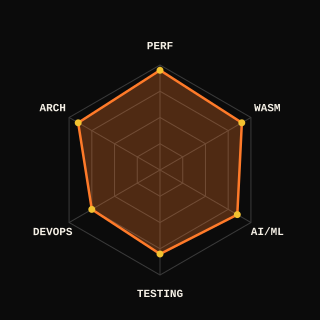
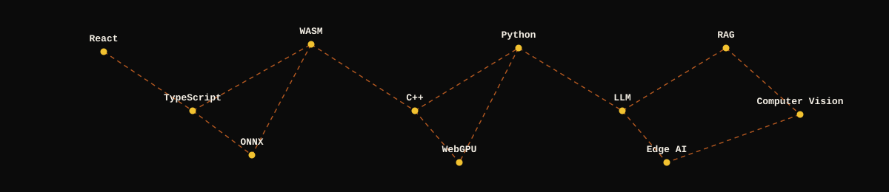

  

  

    
    
  

---

### About

T-Shaped engineer, 8+ years in — the last 4 spent mostly obsessed with getting AI and heavy computation to run client-side instead of on a server bill. I currently work on R&D initiatives with **HP Inc.** (via Conceptu), turning things that "should" need a backend into something that just runs in your browser.

  <table width="100%">
    <tr>
      <td width="50%" align="center">
        
      </td>
      <td width="50%" valign="middle">
        <h4>A few numbers that actually mean something</h4>
        <ul>
          <li>Moved ~40% of a cloud processing workload to the client using WASM/C++ — cloud bill went down, latency too.</li>
          <li>Saved ~60min of CI/CD time per sprint by catching regressions locally instead of in the pipeline.</li>
          <li>Hold an 80% test coverage bar on R&D work that has to stay stable under scrutiny.</li>
          <li>Chased down memory leaks on <2GB RAM Android devices — the unglamorous kind of debugging that actually matters to real users.</li>
        </ul>
      </td>
    </tr>
  </table>

---

### My Expertise At A Glance

---

### Architecture I gravitate toward

  

---

### Things I've built

**RPG Code — a browser-based coding RPG for learning Python/TDD**
Standard JS interpreters choke on real-time TDD validation and lock up the UI during heavy Python loops. I built a non-blocking execution engine with Pyodide running inside isolated Web Workers, plus a custom memory lifecycle in React 19 so restarting the worker 100+ times in a row doesn't leak memory. Result: no UI jank, no crashes, even under load.
**[→ danillogomes.com/code-rpg](https://danillogomes.com/code-rpg/)**

**FinFlow — a zero-knowledge personal finance PWA**
Wanted financial forecasting that works offline and where I, the developer, genuinely can't see anyone's data. Built as a zero-knowledge PWA with client-side encryption, plus a custom "Snowball" algorithm for instant credit-card payoff projections.
**[→ controlebolso.com](https://controlebolso.com/)**

---

### What I'm poking at right now

- **WebGPU**: porting CV models off ONNX Runtime and onto WebGPU — aiming for ~5x faster inference in-browser.
- **SIMD in WASM**: speeding up matrix multiplication for large financial projections.
- **React 19 transitions**: `useActionState` for UI updates that don't feel laggy even on weak hardware.

---

  
   
  

